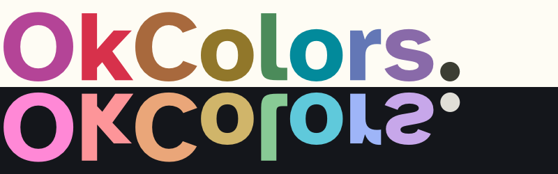

<p align="center">
  
</p>

OkColors is a colorscheme that mashes together ideas from a variety of sources,
including:

- [The Munsell color system](https://en.wikipedia.org/wiki/Munsell_color_system) by
  Albert Munsell
- [The Oklab color space](https://bottosson.github.io/posts/oklab/) by Björn Ottosson
- [Earl Grey](https://earl-grey.halt.wtf) by June Kelley
- [Flexoki](https://stephango.com/flexoki) by Steph Ango
- [Rosé Pine for NeoVim](https://github.com/rose-pine/neovim) by the Rosé Pine
  developers

Two variants are included:

- **Smooth** uses fairly uniform Chroma (saturation), excepting deeper red and magenta
  meant to draw the eye. All foreground/background combinations meet the draft WCAG 3
  contrast requirement for "fluently readable" text.
- **Sharp** employs darker black tones and deeper saturation for colored
  text where possible, while maintaining readable contrast requirements.

Previews are available on the Wiki: [Colorscheme Previews](https://github.com/e-q/okcolors/wiki/Colorscheme-Previews)

## Generating Palette Data

Requires [`just`](https://just.systems/) and [`uv`](https://docs.astral.sh/uv/):

```sh
just compile smooth  # Generates data/okcolors-smooth.json
just compile sharp   # Generates data/okcolors-sharp.json
```

## Other Helpful Resources

- [WCAG 2 Color Contrast Checker](https://www.siegemedia.com/contrast-ratio)
- [Draft WCAG 3 Color Contrast Checker](https://cliambrown.com/contrast/)
- [Okhsv & Okhsl Color Pickers](https://bottosson.github.io/misc/colorpicker)
- [OKLCH Color Picker & Converter](https://oklch.com)
